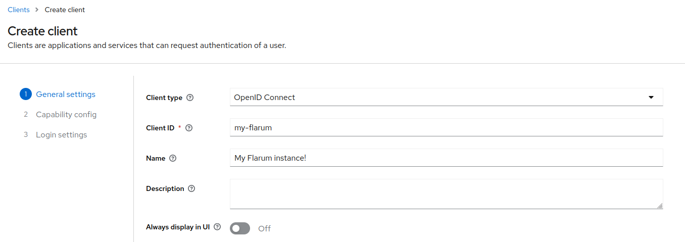
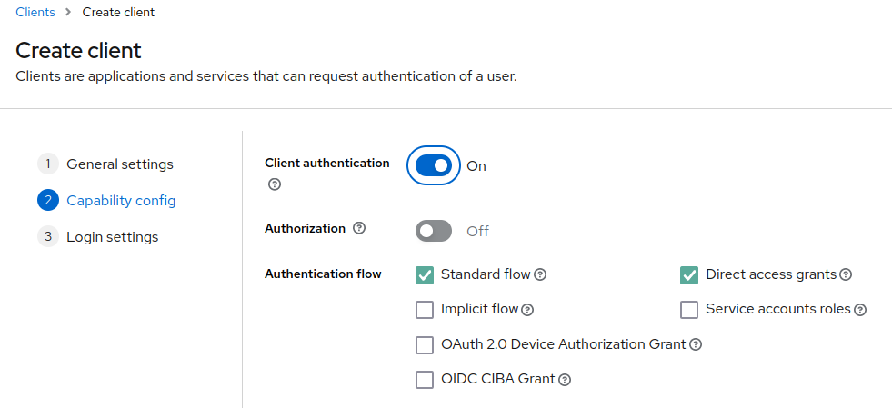
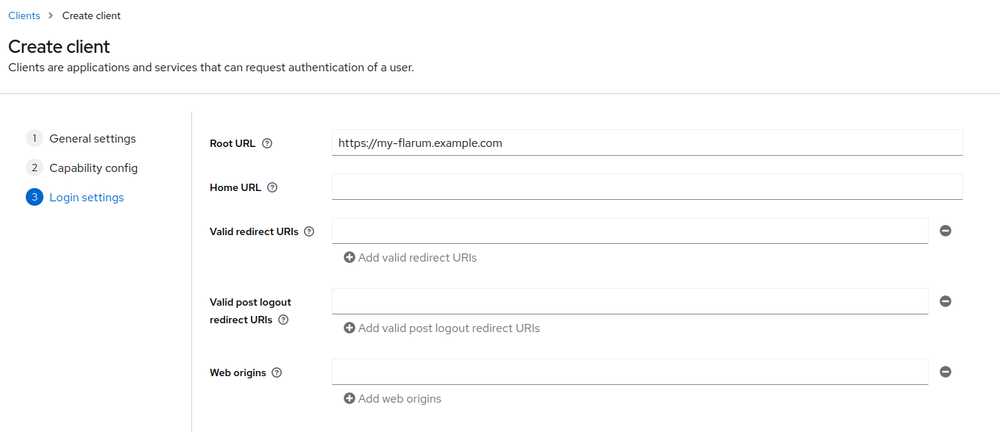
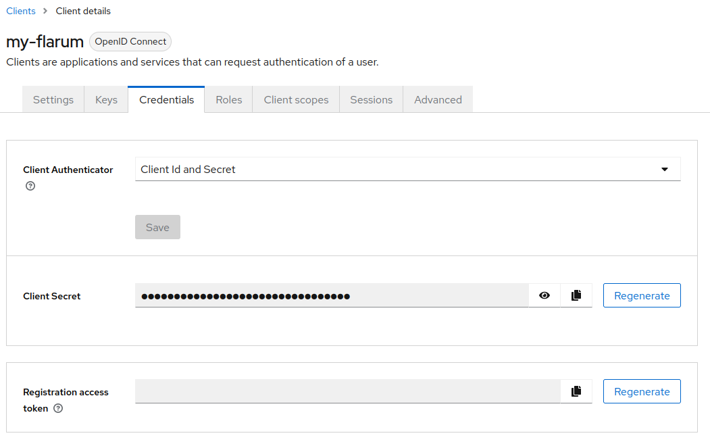
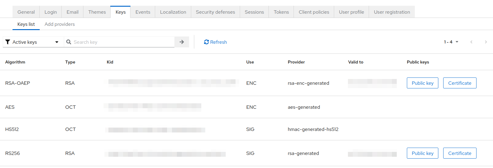
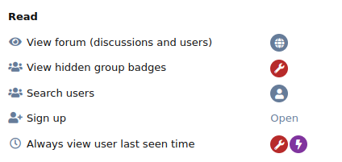
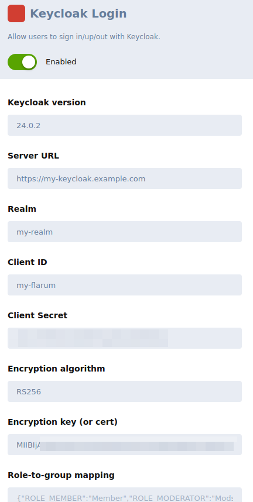
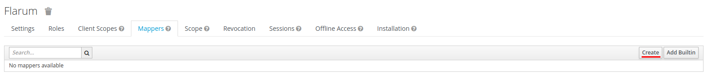
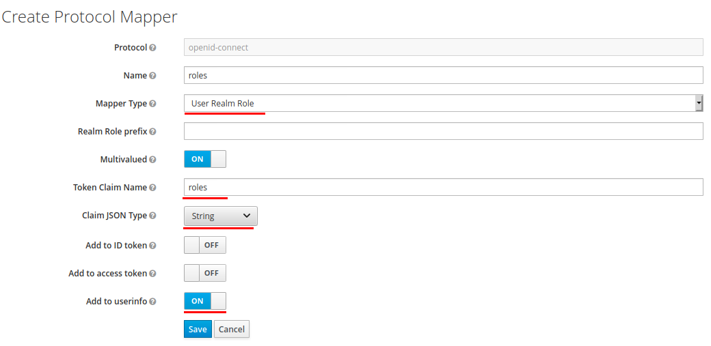

# flarum-ext-auth-keycloak

Keycloak OAuth Flarum Extension

Use your keycloak server to handle user authentication and map roles and attributes.

## Compatibility

Originally written for Keycloak 4.8.3-final and Flarum 0.1.0-beta.5.

Tested up to Keycloak 24.0.2 and Flarum 1.8.4 (versions used for the screenshots).

Your mileage may vary.

## Base setup

### Keycloak

From the _Clients_ tab, create a new client to connect to your Flarum instance.



On step 2, enable Client Authentication. This way the client is `confidential` and gets its own secret. (Optional yet recommended)



On step 3, Root URL should be the base URL of your Flarum instance.



Once the client is created, if you made the client `confidential` in step 2, then head over to its _Credentials_ tab and copy Client Secret somewhere.



Eventually, head over the _Realm Settings_ tab, then find the key used by the OpenId Connect workflow (by default, RS256). Copy the Algorithm somewhere. Copy the Public Key somewhere too (copy what is displayed after you press the "Public key" button).



### Flarum

Install extension via Composer / Packagist.
```
composer require spookygames/flarum-ext-auth-keycloak
```

Head over the Flarum admin panel (for instance https://my-flarum.example.com/admin).

In the Permissions tab, make sure Sign up is Open ([here's why](https://github.com/spookygames/flarum-ext-auth-keycloak/issues/22)).



In the Extensions tab, enable extension and configure as needed.



* Keycloak version: the version of your Keycloak instance.
* Server URL: the URL to your Keycloak instance, like https://keycloak.example.com/auth. Beware the "auth" with no trailing slash for Keycloak versions < 20.
* Realm: the authentication realm you created for your Flarum.
* Client ID: the name of the client you created above.
* Client Secret: paste from client creation step 2, defaults to client ID if you do not override.
* Encryption algorithm: paste from client creation, defaults to RS256.
* Encryption key (or cert): paste from client creation.
* Role-to-group mapping: An associative array with roles as keys and group names as values, in JSON format.  Example: `{"ROLE_MEMBER":"Member","ROLE_MODERATOR":"Mods","ROLE_ADMIN":"Admin"}`.
* Attribute mapping: An associative array with Keycloak attributes as keys and Flarum User attributes as values, in JSON format. Might be used for other extensions. Do not forget client mappers on Keycloak! Example: `{"moniker":"nickname","badges":"badges"}`.
* Delegate avatars: if enabled, the "picture" attribute from Keycloak will be used to handle user avatar instead of Flarum's default behaviour.

* Role-to-group mapping: An associative array with roles as keys and group names as values, in JSON format. Example: `{"ROLE_MEMBER":"Member","ROLE_MODERATOR":"Mods","ROLE_ADMIN":"Admin"}`.
* Attribute mapping: An associative array with Keycloak attributes as keys and Flarum User attributes as values, in JSON format. Might be used for other extensions. Do not forget client mappers on Keycloak! Example: `{"moniker":"nickname","badges":"badges"}`.
* Delegate avatars: if enabled, the "picture" attribute from Keycloak will be used to handle user avatar instead of Flarum's default behaviour.


## Advanced Setup: Sync Keycloak roles with Flarum groups

In order to map Keycloak roles onto Flarum groups, you have to make roles visible from the userinfo endpoint. To this extent, add a mapper to your new client.





## Advanced Setup: Update Flarum avatar with Keycloak picture

## Extension settings

* Keycloak version: the version of your Keycloak instance.
* Server URL: the URL to your Keycloak instance, like https://keycloak.example.com/auth. Beware the "auth" with no trailing slash for Keycloak versions < 20.
* Realm: the authentication realm you created for your Flarum.
* Client ID: the name of the client you created above.
* Client Secret: defaults to client ID if you do not override.
* Encryption algorithm: defaults to RS256.
* Encryption key (or cert): you may copy here the content of what was displayed after you pressed the "Public key" button on Keycloak.
* Role-to-group mapping: An associative array with roles as keys and group names as values, in JSON format. Example: `{"ROLE_MEMBER":"Member","ROLE_MODERATOR":"Mods","ROLE_ADMIN":"Admin"}`.
* Attribute mapping: An associative array with Keycloak attributes as keys and Flarum User attributes as values, in JSON format. Might be used for other extensions. Do not forget client mappers on Keycloak! Example: `{"moniker":"nickname","badges":"badges"}`.
* Delegate avatars: if enabled, the "picture" attribute from Keycloak will be used to handle user avatar instead of Flarum's default behaviour.

## Troubleshooting

### User created with an odd name that does not match actual username like 'tgtplwexeowwluxnqid4cjgw' ([original issue](https://github.com/spookygames/flarum-ext-auth-keycloak/issues/21))

Flarum only allows usernames that match the regular expression `/[^a-z0-9-_]/i`.
Every Keycloak user with a "preferred_username" not matching this expression will instead be assigned a random name, as well as a proper Flarum "nickname".
In order to see the nickname instead of the random username, activate the Nicknames extension and use the User Display Name driver named _nickname_.
